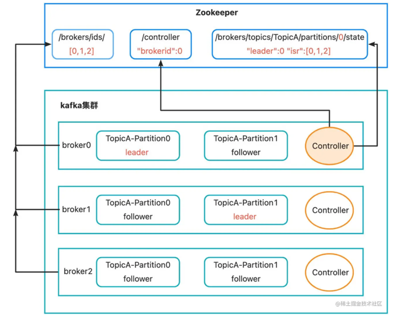
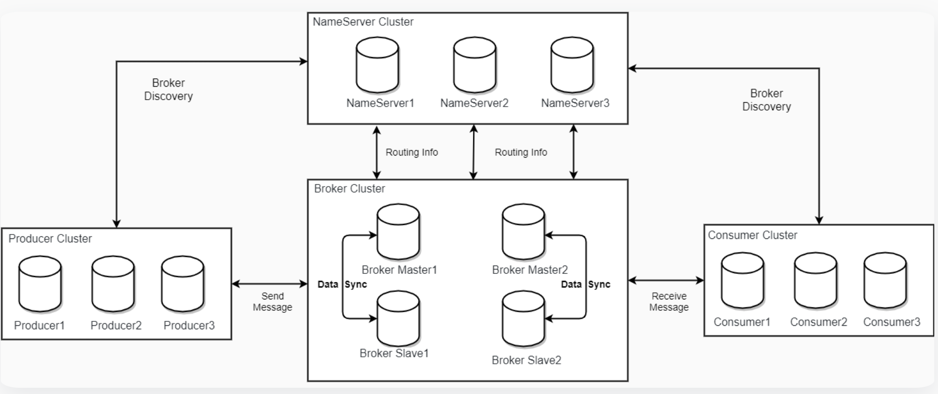

## 存储

- json配置文件读写和复写?
    - mmap内存映射技术
- commitLog是否写满问题?
    - 创建新的commitLog文件
- 定时刷盘?
    - 守护线程
- 多线程更改offset问题?
    - lock锁

## 分发

当消息写入到commitLog文件之后，需要将消息对应的commitLog文件的位置封装成对象，然后写入到consumerQueue中。

- 对象封装(commitLog文件名称、offset等信息)
- 写入操作(单线程)
- queue文件的mmap映射

## nameserver注册中心

- 上线
- 下线
- 心跳

## nameserver集群架构

## broker集群架构

- broker主节点写入
- 从主节点写入到从节点

kafka: 从节点主动拉取主节点信息，降低了主节点的服务压力，但是实时性不强

rocketmq：主节点同步/异步推送给从节点，实时性较强，但是主节点压力比较大

### broker主从切换会出现的问题

- 从节点挂了一段时间后再次恢复的时候，会需要做一个数据对齐
- 🗳️选举

kafka集群架构图：

- kafka broker启动后，会想zookeeper中进行注册
- 会从broker集群节点中，先注册到zookeeper的controller节点上，这个broker作为controller，管理分区和副本
- controller会进行leader选择
- 被选举出来的leader作为读写服务，follower服务定时从leader节点拉取数据

kafka是如何选举leader的？

当leader节点挂了的时候，会从ISR维护的集和中选举除一个作为新的leader，并通知其它follower服务节点

而ISR是和leader保持同步的follower集和

rocketmq集群架构图
